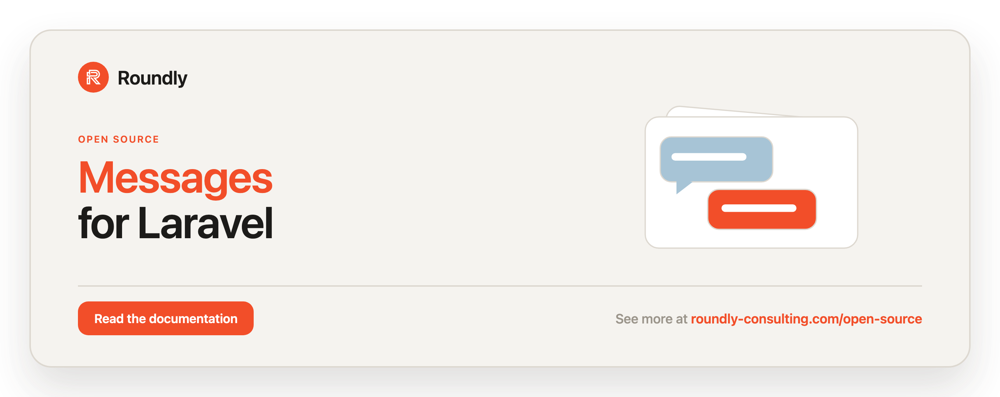

<!-- roundly-hero:start -->
<p align="center">
  <a href="https://roundly-consulting.com/open-source/docs/messages-for-laravel?utm_source=github&utm_medium=readme&utm_campaign=open-source&utm_content=messages-for-laravel">
    
  </a>
</p>
<!-- roundly-hero:end -->

<!-- roundly-badges:start -->
<p align="center">
  <a href="https://packagist.org/packages/roundly-consulting/messages-for-laravel"></a>
  <a href="https://github.com/roundly-consulting/messages-for-laravel/actions/workflows/run-tests.yml"></a>
  <a href="https://github.com/roundly-consulting/messages-for-laravel/actions/workflows/fix-php-code-style-issues.yml"></a>
  <a href="https://donate.stripe.com/dRmeVe8FX5PF1Qd9pXcEw00"></a>
  <a href="https://www.patreon.com/cw/roundly"></a>
  <a href="https://roundly-consulting.com/support-us?utm_source=github&utm_medium=readme&utm_campaign=open-source&utm_content=messages-for-laravel#crypto"></a>
</p>
<!-- roundly-badges:end -->

# Messages for Laravel

A direct-message and group-chat foundation for any Laravel app. Give any Eloquent model a
one-line messaging API, track read receipts and unread counts, react to plain Laravel events,
and (optionally) broadcast every change in real time — all built only on Laravel/Symfony, with
no third-party runtime dependencies.

## Requirements

- PHP `^8.4`
- Laravel `^12.0` or `^13.0`

## Installation

```bash
composer require roundly-consulting/messages-for-laravel
```

Migrations are **not loaded automatically** — publish them first, then migrate:

```bash
php artisan vendor:publish --tag="messages-migrations"
php artisan migrate
```

They land in your `database/migrations` under timestamped filenames that preserve the order
the tables depend on each other in, so they interleave correctly with your own migrations.

Optionally publish the config or translations:

```bash
php artisan vendor:publish --tag="messages-config"
php artisan vendor:publish --tag="messages-translations"
```

The package ships three tables — `messaging_threads`, `messaging_participants`, and
`messaging_messages` — all with soft deletes and a configurable key type (`bigint` by default,
see [Key types](#key-types)).

## Preparing your models

Any model that takes part in messaging (a sender or a participant) must implement
`RoundlyConsulting\Messages\Interfaces\ParticipatesInMessaging`. Add the `HasMessaging` trait
to get the ergonomic API.

```php
use Illuminate\Database\Eloquent\Model;
use RoundlyConsulting\Messages\Concerns\HasMessaging;
use RoundlyConsulting\Messages\Interfaces\ParticipatesInMessaging;

class User extends Model implements ParticipatesInMessaging
{
    use HasMessaging;

    public function participateAs(): array
    {
        return [
            'id' => $this->id,
            'name' => $this->name,
        ];
    }
}
```

Participation is polymorphic, so different model types (a `User` and a `Company`) can share the
same conversation. The trait's writes go through the `MessagesManager`, so `Messages::fake()`
records them like facade calls.

## Usage

Everything is one API in three layers that run the same code: the `Messages` facade, the
injectable `MessagesManager` behind it, and the action classes that hold the behaviour.

### The `Messages` facade

```php
use RoundlyConsulting\Messages\Enums\ParticipantRole;
use RoundlyConsulting\Messages\Facades\Messages;

// Start a conversation — the first participant owns a group thread
$thread = Messages::start('Launch')
    ->public()                 // ->private(), ->direct(), ->everyoneCanJoin()
    ->withParticipants([$alice, $bob])
    ->create();

// Direct messages: one thread per pair, found or created
$dm = Messages::direct($alice, $bob);

// Send
Messages::to($thread)->from($alice)->send('Hello');   // + replyingTo(), withAttachment(), attach()
Messages::send($thread, $alice, 'Hello');             // plain text shortcut

// Read state, inbox and listings
Messages::markRead($thread, $bob);
Messages::unreadCount($bob);                  // across all threads, or pass a thread
Messages::inboxFor($bob, perPage: 20);        // see "Inbox" below
Messages::threads($bob, perPage: 25);         // $bob's threads + public ones; threads() = public only

// One thread
Messages::thread($thread)->rename('Launch crew', by: $alice);
Messages::thread($thread)->archive(by: $alice);
Messages::thread($thread)->markRead($bob);
Messages::thread($thread)->typing($bob);      // broadcast-only, see Broadcasting
Messages::thread($thread)->messages(perPage: 25);   // newest first, senders eager loaded

// Its participants
Messages::thread($thread)->participants()->add($carol, ParticipantRole::Admin, by: $alice);
Messages::thread($thread)->participants()->setRole($carol, ParticipantRole::Member, by: $alice);
Messages::thread($thread)->participants()->remove($carol, by: $alice);
Messages::thread($thread)->participants()->leave($bob);
Messages::thread($thread)->participants()->transferOwnership(from: $alice, to: $bob);

// One message
Messages::message($message)->edit('fixed typo', by: $alice);   // author only
Messages::message($message)->delete(by: $alice);               // author, or a manager

// Housekeeping
Messages::prune(days: 30);                    // defaults to messages.prune.days
```

`by:` is the acting participant; it must be in the thread and is checked against the thread's
roles (see [Participant roles & permissions](#participant-roles--permissions)). Leave it out for
trusted server-side calls — no check runs.

**A sender must be in the thread.** Every send — `to()->from()->send()`, `send()`,
`sendMessageTo()`, the `SendMessage` action — refuses a sender who is not a current participant
(never joined, left, or removed) with an `UnauthorizedMessagingAction`; `typing()` refuses them
with a `ParticipationException`. A system message has no sender and is always allowed. Trusted
server code posting as an outsider (a bot, a support agent) opts out explicitly:

```php
Messages::to($thread)->from($supportBot)->withoutParticipationCheck()->send('We are on it.');
```

**Scoped handles refuse other threads.** `Messages::thread($thread)->message($message)` throws a
`MessageException` when the message belongs to another thread, and every participants method
accepts either the participating model or its `Participant` row — a row from another thread
throws a `ParticipationException`. Prefer the scoped form whenever the thread and the message
both come from the request:

```php
// PATCH /threads/{thread}/messages/{message}
Messages::thread($thread)->message($message)->edit($request->body, by: $request->user());
```

| Method | Returns | Action |
|---|---|---|
| `start(?string $name)` → `PendingThread::create()` | `Thread` | `StartThread` |
| `to(Thread)` → `PendingMessage::send(?string $body)` | `Message` (sender must participate) | `SendMessage` |
| `direct(Model, Model)` | `Thread` | `FindOrCreateDirectThread` |
| `send(Thread, ?Model $sender, string $body)` | `Message` | `SendMessage` |
| `markRead(Thread, Model)` | `Participant` | `MarkRead` |
| `unreadCount(Model, ?Thread)` | `int` | — |
| `inboxFor(Model, perPage, ?page, pageName)` | `LengthAwarePaginator<Thread>` | — |
| `threads(?Model $for, perPage, ?page, pageName)` | `LengthAwarePaginator<Thread>` | — |
| `thread(Thread)` | `ThreadHandle` | — |
| `thread()->rename(?string, by:)` / `archive(by:)` | `Thread` | `RenameThread` / `ArchiveThread` |
| `thread()->markRead(Model)` | `Participant` | `MarkRead` |
| `thread()->typing(Model)` | `void` | `SignalTyping` |
| `thread()->messages(perPage, ?page, pageName)` | `LengthAwarePaginator<Message>` | — |
| `thread()->message(Message)` | `MessageHandle` | — (refuses other threads) |
| `thread()->participants()->add(Model, ?ParticipantRole, by:)` | `Participant` (existing row if already in) | `AddParticipant` |
| `thread()->participants()->remove(Model, by:)` / `leave(Model)` | `void` | `RemoveParticipant` / `LeaveThread` |
| `thread()->participants()->setRole(Model, ParticipantRole, by:)` | `Participant` | `SetParticipantRole` |
| `thread()->participants()->transferOwnership(from:, to:)` | `Participant` | `TransferOwnership` |
| `message(Message)->edit(string, by:)` / `delete(by:)` | `Message` | `EditMessage` / `DeleteMessage` |
| `prune(?int $days, ?Thread)` | `int` | `PruneMessages` |

The three listings read the current page from the request (`?page=`, or `?{pageName}=`) like
Eloquent's own `paginate()`; pass `page:` to pin one explicitly.

### Without the facade

Inject the manager — the same API, no facade:

```php
use RoundlyConsulting\Messages\MessagesManager;

final class ThreadController
{
    public function __construct(private MessagesManager $messages) {}

    public function rename(Thread $thread, Request $request): Thread
    {
        return $this->messages->thread($thread)->rename($request->name, by: $request->user());
    }
}
```

Or run an action yourself — each one is container-resolvable, takes a DTO or plain arguments,
and dispatches its event:

```php
use RoundlyConsulting\Messages\Actions\EditMessage;
use RoundlyConsulting\Messages\DataTransferObjects\EditMessageData;

app(EditMessage::class)->execute(new EditMessageData($message, 'fixed typo', actor: $alice));
```

Actions called directly bypass `Messages::fake()`; the facade, the manager and the model traits
all go through it.

### Testing with `Messages::fake()`

```php
use RoundlyConsulting\Messages\Facades\Messages;

$fake = Messages::fake();

$alice->sendMessageTo($thread, 'Hi');                          // model traits are recorded too
Messages::thread($thread)->rename('Launch', by: $alice);

$fake->assertSent('Hi', to: $thread);
$fake->assertThreadRenamed($thread, to: 'Launch');
$fake->assertNothingDeleted();
```

The fake is a `MessagesManager` subtype, so constructor-injected managers receive it too. It
**still performs** every operation — rows are written, events fire — and records each one that
succeeds, whichever door it came through. Available assertions (each with an `assertNothing…`
counterpart):

| Assertion | Recorded by |
|---|---|
| `assertThreadCreated(?name)` / `assertNothingCreated()` | `start()->create()`, a `direct()` that had to create the thread |
| `assertSent(?body, ?to)` / `assertSentCount(n)` / `assertNothingSent()` | `to()->send()`, `send()`, `sendMessageTo()` |
| `assertThreadRenamed(thread, ?to)` / `assertNothingRenamed()` | `thread()->rename()` |
| `assertThreadArchived(thread)` / `assertNothingArchived()` | `thread()->archive()` |
| `assertMarkedRead(thread, ?by)` / `assertNothingMarkedRead()` | `markRead()`, `markThreadRead()`, `markReadFor()`, `markAsRead()` |
| `assertTyping(thread, ?participant)` / `assertNothingTyping()` | `thread()->typing()`, `$thread->typing()` |
| `assertParticipantAdded(thread, ?participant)` / `assertNothingAdded()` | `participants()->add()`, `joinThread()` — new rows only, not a re-add |
| `assertParticipantRemoved(thread, ?participant)` / `assertNothingRemoved()` | `participants()->remove()` / `leave()` |
| `assertRoleChanged(thread, ?participant, ?role)` / `assertNothingRoleChanged()` | `participants()->setRole()` |
| `assertOwnershipTransferred(thread, ?to)` / `assertNothingTransferred()` | `participants()->transferOwnership()` |
| `assertEdited(message, ?body)` / `assertNothingEdited()` | `message()->edit()` |
| `assertDeleted(message)` / `assertNothingDeleted()` | `message()->delete()` |
| `assertPruned(?days)` / `assertNothingPruned()` | `prune()` |

`$fake->recorded(?MessagingOperation)` returns every recorded `MessagingCall` for custom checks.
Work an action does on its own behalf — the participants `start()` adds, system messages — is
not recorded separately.

## Direct messages (1:1)

The most common case is a single line:

```php
$thread = $alice->conversationWith($bob); // find-or-create the DM
$alice->sendMessageTo($thread, 'Hi Bob!');

$bob->unreadCount();          // 1
$bob->markThreadRead($thread);
$bob->unreadCount();          // 0
```

`conversationWith()` always returns the *same* direct thread for the same two participants, so
you never end up with duplicate DMs. Direct threads are always private.

## Group conversations

```php
$thread = $alice->startConversationWith([$bob, $carol], name: 'Project X');
$alice->sendMessageTo($thread, 'Welcome everyone');

$alice->threads();        // every thread $alice is in, newest activity first
$alice->conversations();  // alias of threads() with a chat-inbox name
$alice->unreadThreads();  // only threads with unread messages
$dave->joinThread($thread);  // only when the thread is open to everyone
```

`joinThread()` is a self-join: it is allowed only on a thread created with `->everyoneCanJoin()`
(or `messages.publicity.everyone-can-join`) and throws an `UnauthorizedMessagingAction`
otherwise — direct threads are never open. For someone who is already in the thread it is a
no-op returning their row. To bring someone into a closed thread, a manager adds them:
`Messages::thread($thread)->participants()->add($dave, by: $alice)`.

Adding someone who is already a participant never creates a second row: `add()` returns their
existing `Participant` unchanged (no event, no system message, no role change — use `setRole()`
for that). Someone who left and is added again gets a fresh row.

## Participant roles & permissions

Group threads carry per-participant roles — **owner**, **admin**, **member**
(`RoundlyConsulting\Messages\Enums\ParticipantRole`). The participant who starts a thread is
its owner; everyone added afterwards joins as a member. Owners and admins may add/remove
participants, rename and archive the thread, and moderate anyone's messages; members may only
manage their own messages. Changing roles is the **owner's** alone — an admin can add members
but can neither promote anyone to admin nor demote a fellow admin. Removing someone takes a role
**above** theirs: the owner removes admins and members, an admin removes members only — never a
fellow admin or the owner.

**Ownership only moves through `transferOwnership()`.** `setRole()` never grants the owner role
and never changes the owner's role, `add()` never creates a second owner, and the owner cannot
leave — or be removed — while anyone else is still in the thread; hand ownership over first (the
last one out may simply leave). This holds for every caller, trusted ones included, and with roles
switched off. Each refusal throws a `ParticipationException`.

```php
use RoundlyConsulting\Messages\Enums\ParticipantRole;
use RoundlyConsulting\Messages\Facades\Messages;

$thread->roleOf($bob);            // ParticipantRole::Member|Admin|Owner|null
$thread->canManage($bob);         // bool

$participants = Messages::thread($thread)->participants();

$participants->setRole($bob, ParticipantRole::Admin, by: $alice);
$participants->transferOwnership(from: $alice, to: $bob); // $alice is demoted to admin
```

Role enforcement is opt-out via `messages.permissions.enabled` (default `true`) and is **skipped
for direct threads**, which are always roleless: there, and with roles off, every participant is
a peer who may manage the thread. **An actor must always be a participant**, though — whatever the
config and thread type, someone who is not in the thread (or has left it) cannot send, rename,
archive, manage participants, or edit or delete messages in it, including their own. When an actor
is refused the action throws a typed `RoundlyConsulting\Messages\Exceptions\UnauthorizedMessagingAction`.
Passing no `by:` actor skips the role check, so trusted server-side code keeps working unchanged;
a sender is always checked unless you call `withoutParticipationCheck()`.

Renaming and archiving:

```php
Messages::thread($thread)->rename('New name', by: $alice);
Messages::thread($thread)->archive(by: $alice);
$thread->isArchived();   // true
```

### Enum helpers

> Integrates with [`enums-for-laravel`](https://github.com/roundly-consulting/enums-for-laravel).

`ParticipantRole` and `MessageType` adopt the `RoundlyConsulting\Enums\Helpers` trait, so both
expose readable labels, select-ready option lists, and a drift-proof validation rule alongside
their domain methods (`canManage()`, `outranks()`, …):

```php
use RoundlyConsulting\Messages\Enums\ParticipantRole;

ParticipantRole::labels();          // ['Owner', 'Admin', 'Member']
ParticipantRole::toOptions();       // ['owner' => 'Owner', 'admin' => 'Admin', 'member' => 'Member']
ParticipantRole::options();         // Collection<EnumOption{ value, label, name }> for JS/Inertia selects
ParticipantRole::validationRule();  // 'in:owner,admin,member'
ParticipantRole::Owner->label();    // 'Owner'
```

enums-for-laravel is a hard dependency (Tier 0), so the helpers are always available — there is
nothing to install or configure separately. See [`docs/cross-package-integration-plan.md`](https://github.com/roundly-consulting/docs) for the tier DAG.

## Replies & quoting

Any message can reply to another in the same thread. A lightweight snapshot of the quoted
message is stored on the reply, so the quote survives the parent being edited or deleted.

```php
use RoundlyConsulting\Messages\Facades\Messages;

$reply = Messages::to($thread)->from($bob)->replyingTo($original)->send('On it!');

$reply->parent;       // the quoted message (relation)
$original->replies;   // every reply to it
$reply->meta['quote']; // ['id', 'sender_id', 'sender_type', 'excerpt'] snapshot
```

Replying to a message in a different thread throws a `MessageException`.

## Attachments

> Integrates with [`media-library-for-laravel`](https://github.com/roundly-consulting/media-library-for-laravel).
> See the org-wide [cross-package integration plan](https://github.com/roundly-consulting) for how
> the packages compose.

Messages carry first-class file attachments backed by media-library. Each message owns a private
`attachments` bucket: images get a responsive width ladder, any other file type (PDF, zip, …) is
stored as a passthrough original. Attachments are **private by default** and reachable only through
media-library's signed, short-lived streaming URLs — regardless of whether the thread is public.
To keep the signed URL the only way in, private attachments (and their variants) are stored on
`messages.media.private_disk` — Laravel's non-public `local` disk by default — never on
media-library's default `public` disk, which `php artisan storage:link` serves under `/storage`.

media-library is a hard dependency, so there is nothing to opt into; install it alongside messages
and configure a disk:

```bash
composer require roundly-consulting/messages-for-laravel
php artisan vendor:publish --tag="media-config"   # set the attachments disk + streaming route
php artisan migrate                               # creates the `media` table
```

### Sending with attachments

The message builder accepts both pre-uploaded **draft media tokens** and freshly **uploaded
files**. Both are bound to the message inside `SendMessage` — in a transaction, before
`MessageSent` fires — so listeners, broadcasts, and recipients see the attachments immediately. A
bad/expired draft token aborts the whole send (no orphan message).

```php
use RoundlyConsulting\Messages\Facades\Messages;

$message = Messages::to($thread)->from($alice)
    ->withAttachment($draftToken)                 // a media-library draft token
    ->withAttachments([$tokenA, $tokenB])         // several at once
    ->attach($request->file('photo'))             // an UploadedFile
    ->send('Here are the files');
```

You can also attach directly to a persisted message via media-library's fluent adder:

```php
$message->addMedia($uploadedFile)->toMediaBucket('attachments');
```

### Reading attachments

```php
$message->attachments();        // Collection<Media> — every attachment
$message->imageAttachments();   // images only
$message->fileAttachments();    // non-image (passthrough) files
$message->hasAttachments();     // bool
```

### Private, signed URLs

```php
$media = $message->imageAttachments()->first();

$message->attachmentUrl($media);                  // signed, short-lived stream URL
$message->attachmentDownloadUrl($media);          // forces a download (attachment)
$message->attachmentPreviewUrl($media, 'responsive-640'); // a variant preview (images only)
```

`attachmentPreviewUrl()` throws a `MessageException` for a non-image attachment. Responsive
`srcset()` over private media needs a signed URL per candidate width, so use it only when the
bucket is configured public.

### Variants & cleanup

When a message is sent, a queued `WarmMessageMediaVariants` listener dispatches media-library's
`GenerateVariantsJob` for each image attachment, so previews are ready when the message lands.
Force-deleting a message (hard delete / prune) removes its attachment files; soft-deleting
(unsending) a message keeps them.

### Configuration

```php
// config/messages.php
'media' => [
    'attachments_bucket'      => 'attachments', // media-library bucket name
    'disk'                    => env('MESSAGES_MEDIA_DISK', null),       // null = by visibility (below)
    'private_disk'            => env('MESSAGES_MEDIA_PRIVATE_DISK', 'local'), // private attachments when 'disk' is null
    'visibility'              => env('MESSAGES_MEDIA_VISIBILITY', 'private'), // 'private' | 'public'
    'accepted_mime_types'     => [],            // [] = accept any file
    'max_file_size'           => null,          // bytes; null = media default
    'responsive_widths'       => null,          // null = media default ladder
    'warm_on_send'            => true,          // queue variant generation on send
    'temporary_url_lifetime'  => null,          // minutes; null = media default
    'cleanup_on_force_delete' => true,          // remove files on hard delete / prune
],
```

An explicit `disk` is used for every attachment whatever its visibility, so keep it non-public
while attachments are private; `private_disk` can point at any non-public disk (e.g. private S3).

## Notifications

Opt in to bridge new messages to Laravel notifications. When enabled, every sent message
notifies the thread's other notifiable participants (the sender is never notified, and
non-notifiable participants are skipped).

```dotenv
MESSAGES_NOTIFICATIONS=true
```

```php
// config/messages.php
'notifications' => [
    'enabled' => env('MESSAGES_NOTIFICATIONS', false),
    'notification' => RoundlyConsulting\Messages\Notifications\NewMessageNotification::class,
    'channels' => ['database'],   // mail is never forced
],
```

Point `notifications.notification` at your own class (or publish the default with
`vendor:publish --tag=messages-notifications`) to customise channels and content.

## Inbox

`Messages::inboxFor()` returns a paginator of the participant's threads — newest activity first
— with the latest message (and its sender), participants, and a per-thread `unread_count`
eager-loaded, so a chat sidebar renders without N+1 queries.

Each thread carries a denormalised `last_message_id` pointer, so loading the latest message is a
single indexed lookup per page rather than a scan of every message in every thread — the inbox
stays flat as threads grow. The pointer is kept current automatically on every send, edit,
unsend, restore and prune; you never maintain it.

```php
$inbox = Messages::inboxFor($bob, perPage: 20);

foreach ($inbox as $thread) {
    $thread->unread_count;            // integer
    $thread->latestMessagePreview();  // short, type-aware preview string
}
```

A few thread helpers complement it:

```php
$thread->markReadFor($bob);          // same as Messages::markRead($thread, $bob)
$thread->latestMessagePreview();     // null when the thread is empty
$message->isReadBy($bob);            // has $bob read up to this message?
```

The alias `Messages` is auto-registered; you can also import the FQCN to avoid any clash.

## Read receipts & unread counts

```php
$thread->unreadCountFor($user);   // messages $user hasn't read (excludes their own)
$thread->seenBy($message);        // participants whose read pointer is at/after $message

$participant->hasUnread();
$participant->markAsRead();       // same as Messages::markRead() for that participant
```

Read state follows each participant's read pointer, `last_read_message_id` — the message they had
reached when they last marked the thread read. A message is unread when it sorts after that
message (by `created_at`, then by key) or they have never read anything, and they are not its
sender. `read_at` only records *when* they read, so a reply that lands in the same second as the
read still counts as unread. Should the pointer message be pruned later, `read_at` stands in
for it.

## Editing, unsending & system messages

```php
Messages::message($message)->edit('edited body', by: $alice);
Messages::message($message)->delete(by: $alice); // soft delete ("unsent")
```

Only the **author** may edit a message — not even an owner or admin, and regardless of
`messages.permissions.enabled`. Deleting is allowed to the author and, in a group thread with
roles enforced, to owners and admins. Editing or deleting an already-deleted message throws a
typed `RoundlyConsulting\Messages\Exceptions\MessageException`.

Enable system messages (e.g. "Alice joined") with `messages.system-messages.enabled`. They are
stored as a `MessageType::System` message with a translation key as the body and the parameters
in the `meta` JSON column, so they render correctly in any locale.

## The action & DTO layer

All writes funnel through small, container-resolvable actions that accept DTOs and dispatch the
matching event. The facade reaches every one of them (see the table under [Usage](#usage));
advanced consumers can also run them directly:

| Action | Input |
|---|---|
| `StartThread` | `CreateThreadData` |
| `SendMessage` | `SendMessageData` |
| `AddParticipant` | `AddParticipantData` (+ optional actor) |
| `RemoveParticipant` | `RemoveParticipantData` (+ optional actor) |
| `LeaveThread` | thread + participant |
| `MarkRead` | `MarkReadData` |
| `EditMessage` | `EditMessageData` (+ optional actor, must be the author) |
| `DeleteMessage` | `Message` (+ optional actor) |
| `FindOrCreateDirectThread` | two models |
| `SetParticipantRole` | `SetParticipantRoleData` |
| `TransferOwnership` | thread + current/new owner |
| `RenameThread` / `ArchiveThread` | thread (+ optional actor) |
| `SignalTyping` | thread + participant |
| `PruneMessages` | `PruneMessagesData` |

## Events

Plain Laravel events fire from every write path **regardless of whether broadcasting is on**,
so non-broadcasting apps can still react (notifications, search indexing, activity logs):

`ThreadCreated`, `MessageSent`, `MessageEdited`, `MessageDeleted`, `ParticipantJoined`,
`ParticipantLeft`, `ThreadRead`, `ThreadRenamed`, `ThreadArchived`, and `ParticipantTyping`
(all under `RoundlyConsulting\Messages\Events`).

`ParticipantTyping` is a transient, never-persisted signal you can broadcast for live typing
indicators — see Broadcasting below.

```php
Event::listen(MessageSent::class, function (MessageSent $event): void {
    // $event->message
});
```

## Query scopes

```php
Thread::query()->direct();
Thread::query()->forParticipant($user);
Thread::query()->between($alice, $bob);
Message::query()->unreadFor($user);
Participant::query()->unread();            // never marked the thread read
Participant::query()->readUpTo($message);  // read pointer at or past $message
```

## API resources

JSON resources are provided for building a messaging API or an Inertia/SPA backend. They expose
only safe fields, render read-state and reply info, and degrade gracefully when relations are not
eager-loaded.

```php
use RoundlyConsulting\Messages\Http\Resources\ThreadResource;
use RoundlyConsulting\Messages\Http\Resources\MessageResource;
use RoundlyConsulting\Messages\Http\Resources\ParticipantResource;

return ThreadResource::collection(Messages::inboxFor($request->user()));
return MessageResource::collection(Messages::thread($thread)->messages());
```

Both paginators follow the request's `?page=`, so the envelope's `meta.current_page` and its
`links.next` stay in step for an infinite-scroll client.

Publish them into your app to customise (`vendor:publish --tag=messages-resources`).

## Configuration

```php
return [
    'models' => [
        'message' => RoundlyConsulting\Messages\Models\Message::class,
        'thread' => RoundlyConsulting\Messages\Models\Thread::class,
        'participant' => RoundlyConsulting\Messages\Models\Participant::class,
    ],

    'primary_key_type' => env('MESSAGES_PRIMARY_KEY_TYPE', 'bigint'),

    'publicity' => [
        'public-by-default' => env('THREADS_PUBLIC', false),
        'everyone-can-join' => env('THREADS_EVERYONE_CAN_JOIN', false),
    ],

    'system-messages' => [
        'enabled' => env('MESSAGES_SYSTEM_MESSAGES', false),
    ],

    'permissions' => [
        'enabled' => env('MESSAGES_PERMISSIONS', true),
    ],

    'notifications' => [
        'enabled' => env('MESSAGES_NOTIFICATIONS', false),
        'notification' => RoundlyConsulting\Messages\Notifications\NewMessageNotification::class,
        'channels' => ['database'],
    ],

    'preview' => [
        'length' => env('MESSAGES_PREVIEW_LENGTH', 120),
    ],

    'prune' => [
        'days' => env('MESSAGES_PRUNE_DAYS', 90),
    ],

    'broadcasting' => [
        'enabled' => env('REALTIME_MESSAGES', false),
        // channels + event names for threads, participants and messages
    ],
];
```

| Key | Type | Default | Backed by |
|---|---|---|---|
| `models.message` / `models.thread` / `models.participant` | class-string | the package models | — |
| `primary_key_type` | `bigint`\|`uuid`\|`ulid` | `bigint` | `MESSAGES_PRIMARY_KEY_TYPE` | The key type of the package's own tables and every internal foreign key. Fixed at first migrate. See [Key types](#key-types). |
| `publicity.public-by-default` | bool | `false` | `THREADS_PUBLIC` |
| `publicity.everyone-can-join` | bool | `false` | `THREADS_EVERYONE_CAN_JOIN` |
| `system-messages.enabled` | bool | `false` | `MESSAGES_SYSTEM_MESSAGES` |
| `permissions.enabled` | bool | `true` | `MESSAGES_PERMISSIONS` |
| `notifications.enabled` | bool | `false` | `MESSAGES_NOTIFICATIONS` |
| `notifications.notification` | class-string | `NewMessageNotification` | — |
| `notifications.channels` | list | `['database']` | — |
| `preview.length` | int | `120` | `MESSAGES_PREVIEW_LENGTH` |
| `prune.days` | int | `90` | `MESSAGES_PRUNE_DAYS` |
| `broadcasting.enabled` | bool | `false` | `REALTIME_MESSAGES` |
| `broadcasting.*.channel` / `*.events.*` | string | see config | — |

Swap any `models.*` entry for your own subclass to extend behaviour.

### Key types

`primary_key_type` sets the key type of the package's own tables — `messaging_threads`,
`messaging_messages`, `messaging_participants` — **and every internal foreign key between
them** (`thread_id`, `parent_message_id`, `last_read_message_id`). It is read when the
migrations run, so choose it **before** you publish and migrate; changing it afterwards is a
data migration, not a config change.

```dotenv
MESSAGES_PRIMARY_KEY_TYPE=uuid   # bigint (default) | uuid | ulid
```

**Why it defaults to `bigint`.** A thread or a message is a thing other packages point *at*
polymorphically, and a Laravel morph column (`$table->morphs('subject')`) is an unsigned
bigint. On a strict engine such as PostgreSQL, a `uuid` id will not go into one:

```
SQLSTATE[22P02]: invalid input syntax for type bigint: "019f6f33-22b8-737f-a581-849e7cdc517a"
```

SQLite will **not** warn you about this — its type affinity stores the string in an integer
column silently, so a green SQLite suite proves nothing here.

> **Constraint:** this assumes every morph target in your application shares one key type. If
> you set `MESSAGES_PRIMARY_KEY_TYPE=uuid`, the models on the other end of your polymorphic
> relations need to be uuid-keyed too, and the packages owning those columns need to agree. A
> mixed application — a `uuid` `Thread` and a `bigint` `Post` pointed at by the same morph
> column — is not supported by this package, by Laravel's own `morphs()`/`uuidMorphs()` split,
> or by anything else. Pick one key type per application.

## Broadcasting

Broadcasting is **off by default** — the plain events above still fire either way. Turn it on
to push changes live over Laravel broadcasting (Reverb, Pusher, Ably, …):

```dotenv
REALTIME_MESSAGES=true
```

When enabled, the models use Laravel's `BroadcastsEvents` on create/update/delete/restore.
Channel and event names are fully configurable.

- `messaging` — public thread channel.
- `messaging.participant.{name}.{id}` — private per-participant channel for private threads.
- `messaging.thread.{id}` — per-thread channel for participant and message events.

Broadcast a live typing indicator with `Messages::thread($thread)->typing($user)` (or
`$thread->typing($user)`) — it only broadcasts (never persists) and respects
`broadcasting.enabled`.

## Pruning old messages

```bash
php artisan messages:prune --days=30          # defaults to MESSAGES_PRUNE_DAYS
php artisan messages:prune --thread={uuid}    # limit to one thread
```

Or from code: `Messages::prune(days: 30, thread: $thread)` returns how many were removed.

## Testing helpers

`Messages::fake()` and its assertions are covered under
[Testing with `Messages::fake()`](#testing-with-messagesfake).

Factories ship handy states: `Thread::factory()->direct()/public()/private()`,
`Message::factory()->system()`, and `Participant::factory()->read()/unread()`.

For host-app test suites, the `InteractsWithMessaging` trait adds fluent helpers and the
`MessageExpectations` matchers register Pest expectations:

```php
// tests/Pest.php
RoundlyConsulting\Messages\Testing\MessageExpectations::register();

// in a test
uses(RoundlyConsulting\Messages\Testing\InteractsWithMessaging::class);

$thread = $this->startConversation($alice, $bob);
$this->actingAsParticipant($alice)->sendMessageAs($thread, 'Hi');

expect($thread)
    ->toHaveSentMessage('Hi')
    ->toHaveParticipant($bob)
    ->toHaveUnread($bob)
    ->toHaveRole($alice, ParticipantRole::Owner);
```

## Testing

```bash
composer test
```

## Changelog

See [CHANGELOG.md](CHANGELOG.md) for recent changes.

<!-- roundly-support:start -->
## Support our work

This package is free and open source, built and maintained by
[Roundly Consulting](https://roundly-consulting.com/open-source?utm_source=github&utm_medium=readme&utm_campaign=open-source&utm_content=messages-for-laravel).
If it saves you time, please consider supporting our open-source work — a one-time donation, a
monthly pledge on Patreon or a crypto donation helps fund maintenance, new features and new
packages.

<a href="https://donate.stripe.com/dRmeVe8FX5PF1Qd9pXcEw00"></a>
<a href="https://www.patreon.com/cw/roundly"></a>
<a href="https://roundly-consulting.com/support-us?utm_source=github&utm_medium=readme&utm_campaign=open-source&utm_content=messages-for-laravel#crypto"></a>
<!-- roundly-support:end -->

## License

The MIT License (MIT). See [LICENSE.md](LICENSE.md).
